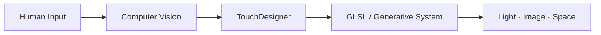

<div align="center">
  
</div>

<div align="center">
  <br />
  <strong>INTERACTION × LIGHT × MOTION</strong>
  <br />
  <sub>감각과 기술 사이에서 살아 움직이는 장면을 만듭니다.</sub>
  <br /><br />
  <a href="https://derivative.ca/"></a>
  
  
  
</div>

<br />

## CURRENT SIGNAL

```text
ROLE        Media Artist · Creative Coder
FOCUS       Real-time visuals · Interactive systems · Generative motion
TOOLS       TouchDesigner · GLSL · Python · Computer Vision
STATUS      Building RORORO with a three-person art team
```


## SELECTED PROJECT

### [RORORO](https://github.com/Sungryong-Ryu/RORORO)

> A collaborative media-art laboratory built with TouchDesigner.

실시간 그래픽, 인터랙션, 센서 입력을 하나의 공연 가능한 시스템으로 연결하는 미디어 아트 프로젝트입니다. 세 명의 팀원이 충돌 없이 실험하고 통합할 수 있는 제작 방식을 함께 설계하고 있습니다.

`TouchDesigner` · `GLSL` · `Python` · `Real-time Interaction`

<br />

## CREATIVE FREQUENCIES

| 01 — GENERATIVE | 02 — INTERACTIVE | 03 — IMMERSIVE |
|:---|:---|:---|
| 규칙에서 태어나는 예측 불가능한 형태 | 몸짓과 공간에 반응하는 시각 시스템 | 빛, 움직임, 소리가 만드는 하나의 장면 |

<br />

## TOOLBOX



<br />

## LET'S MAKE SOMETHING ALIVE

새로운 감각, 실시간 이미지, 인터랙티브 공간에 관심이 있습니다.  
프로젝트와 실험은 이곳에 천천히 기록합니다.

<div align="center">
  
  <sub>© Sungryong Ryu · Rendered in real time, imagined beyond the frame.</sub>
</div>
